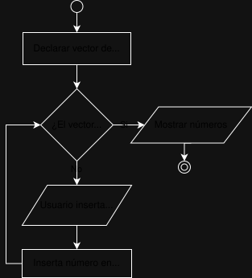
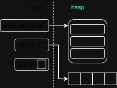

<div align="right">
    
</div>

# TP

## Información del estudiante

* Nicolas Martinez
* 115882
* nicolasmartinezalfonso@gmail.com
* Nicomartinez07

## Índice
* [1. Instrucciones](#1-Instrucciones)
  * [1.1. Compilar el proyecto y correr pruebas con valgrind](#11-Compilar-el-proyecto-y-correr-pruebas-con-valgrind)
  * [1.2. Ejecutar las pruebas](#12-Ejecutar-las-pruebas)
  * [1.3. Ejecutar el programa con Valgrind](#13-Ejecutar-el-programa-con-Valgrind)
* [2. Funcionamiento](#2-Funcionamiento)
* [3. Estructura](#3-Estructura)
  * [3.1. Diagrama de memoria](#31-Diagrama-de-memoria)
  * [3.2. Análisis de complejidades](#32-Análisis-de-complejidades)
* [4. Decisiones de diseño y/o complejidades de implementación](#4-Decisiones-de-diseño-yo-complejidades-de-implementación)
* [5. Respuestas a las preguntas teóricas](#5-Respuestas-a-las-preguntas-teóricas)

## 1. Instrucciones.

### 1.1. Compilar el proyecto y correr pruebas con valgrind
```bash
make
```

### 1.2. Ejecutar las pruebas 
```bash
make pruebas
```

### 1.3. Ejecutar el programa con Valgrind
```bash
make valgrind_alumno
```

## 2. Funcionamiento
Explicar **qué** hace el TP implementado, aclarando todas las decisiones de funcionamiento que no estaban definidas por el enunciado. Se deben incluir todos los diagramas que consideren necesarios para explicar el funcionamiento del programa.

> [!IMPORTANT]
> Es muy importante entender la *diferencia entre qué y cómo*. En esta sección **NO** se busca una explicación de cómo implementaste el programa, qué funciones usaste, en qué línea, etc.; se busca una explicación de **qué** es lo que hace el programa en líneas generales. 

> [!WARNING]
> Es importante usar diagramas para explicar los conceptos de forma clara, pero el exceso será negativo. Los diagramas deben tener un fin explicativo y, por lo general, sirven para reemplazar uno o múltiples párrafos de explicación.

## 2. Funcionamiento (EJEMPLO)
El programa recibe 7 números del usuario y una vez obtenidos todos los muestra en pantalla. Para esto define un vector estático de 7 elementos y llena el mismo con los datos que inserta el usuario; cuando termina de insertar todos los números procede a imprimirlos en pantalla.
<div align="center">
  
  <p>Diagrama de flujo del programa explicado con más detalle.</p>
</div>

## 3. Estructura
Explicar cómo se implementó la/s estructura/s pedida/s en el [enunciado](./ENUNCIADO.md). En esta sección el objetivo es explicar en líneas generales, no técnicas, qué contiene la estructura, para qué y por qué.

## 3. Estructura (EJEMPLO)
Para implementar la estructura decidí hacerlo con un campo..., además tiene un puntero que... y eso permite que....

### 3.1. Diagrama de memoria
Realizar un diagrama de memoria de la estructura de memoria durante la ejecución del programa, esto debe incluir el stack y el heap con las estructuras contenidas en ellos.


RESOLUCION: DIAGRAMA DE MEMORIA EL CUAL MUESTRE TODO EL FUNCIONAMIENTO DEL MAIN: TEXTO Q ME AYUDE A EPLXIAR

### 3.1 Diagrama de memoria (EJEMPLO)
<div align="center">
  
  <p>Diagrama de memoria de la estructura.</p>
</div>


### 3.2. Análisis de complejidades

A continuacion se va a realizar un analisis de complejidad sobre los 3 tipos de TDA distintos que se piden implementar en el TP. 

### Análisis de complejidades de funciones TDA lista.

* `lista_crear` tiene una complejidad de $O(1)$ ya que únicamente se realizan instrucciones para solicitar memorias e inicializar variables.

* `lista_cantidad` tiene una complejidad de $O(1)$ ya que únicamente se retorna un dato perteneciente a la lista.

* `lista_esta_vacia` tiene una complejidad de $O(1)$ ya que se únicamente se retorna un valor, en base a un dato de la lista.

* `lista_insertar` tiene una complejidad de $O(n)$ debido a que si queremos insertar en una posición que no es la primera o la ultima de la lista. Se realiza un recorrido de Posición-1 nodos, hasta encontrar la posición correcta e insertarlo, en el peor de los casos esto podría significar n -1 iteraciones. Si solamente se pudiera insertar en la primera o en la ultima posición la función tendria una complejidad de $O(1)$ debido a que son instrucciones constantes, no se debería realizar iteración por la estructura interna que tiene la lista_t.

* `lista_eliminar` tiene una complejidad de $O(n)$ debido a que si queremos eliminar un elemento en una posición que no es la primera. Se realiza una iteración de  nodos, hasta encontrar su posición y eliminarlo, en el peor de los casos esto podría significar recorrer toda la lista. Si solamente se pudiera eliminar en la primera la función tendria una complejidad de $O(1)$ debido a que son instrucciones constantes.

* `lista_reemplazar` tiene una complejidad de $O(n)$ ya que para reemplazar un elemento hay que recorrer la lista hasta encontrarlo y reemplazarlo. Tomando el peor de los casos (el que el elemento este en la ultima posición) se tiene que recorrer la lista entera para reemplazarlo.

* `lista_obtener` tiene una complejidad de $O(n)$ ya que para obtener un elemento hay que recorrer la lista hasta encontrarlo y retornarlo. Tomando como el peor de los casos (el elemento este en la ultima posición), se recorre la lista entera para obtenerlo.

* `lista_buscar` tiene una complejidad de $O(n)$ considerando que la función comparador tiene una complejidad $O(1)$, debido a que en el peor caso el elemento buscado se encuentra en el N elemento. Si fuera el caso de que la función comparador tiene una complejidad $O(m)$ la complejidad final seria $O(n x m)$ lo que se reduce a $O(n)$.

* `lista_iterar` tiene una complejidad de $O(n)$ ya que en el peor de los casos todos los elementos al aplicarle la función F, devuelven Verdadero, por ende se recorrería la cantidad de nodos que contenga la lista.

* `lista_destruir` tiene una complejidad de $O(n)$ ya que se tiene que recorrer N cantidad de nodos, y aplicarle una cantidad de instrucciones constantes. 

* `lista_destruir_todo` tiene una complejidad de $O(n)$ ya que se tiene que recorrer N cantidad de nodos, y aplicarle una cantidad de instrucciones constantes. 

* `lista_iterador_crear` tiene una complejidad de $O(1)$ ya que únicamente se realizan instrucciones para solicitar memorias y vincular la lista pasada por parámetro.

* `lista_iterador_se_puede_iterar` tiene una complejidad de $O(1)$ ya que realiza una sola instrucción que es una verificación.

* `lista_iterador_siguiente` tiene una complejidad de $O(1)$ ya que únicamente se repunta el elemento actual de la lista iterada.

* `lista_iterador_obtener_elemento` tiene una complejidad de $O(1)$ ya que únicamente se retorna el dato del elemento al que el iterado esta apuntando.

* `lista_iterador_destruir` tiene una complejidad de $O(1)$ ya que simplemente es una instrucción para liberar memoria.


### Análisis de complejidades de funciones TDA cola.

* `cola_crear` tiene una complejidad de $O(1)$ ya que únicamente se realizan instrucciones para solicitar memorias e inicializar variables.

* `cola_encolar` tiene una complejidad de $O(1)$ debido a que se invoca a la función lista_insertar() que con los parámetros enviados, es de complejidad $O(1)$ por ende al sumar la cantidad de instrucciones mas la función encolar termina siendo un proceso de complejidad $O(1)$.

* `cola_desencolar` tiene una complejidad de $O(1)$  debido a que se invoca a la función lista_eliminar() que cuando se eliminar el primer elemento de la lista, es de complejidad $O(1)$ por ende al sumar la cantidad de instrucciones mas la función eliminar termina siendo un proceso de complejidad $O(1)$.

* `cola_frente` tiene una complejidad de $O(1)$ porque a pesar de que se invoca a la función lista_obtener() que en el peor caso tiene complejidad $O(n)$, con los parámetros ingresados se cumple el mejor caso y pasa a ser una función $O(1)$ y la suma total de complejidad es de $O(1)$

* `cola_esta_vacia` tiene una complejidad de $O(1)$ porque únicamente se retorna el resultado de invocar una función (lista_esta_vacia) cuya complejidad es $O(1)$.

* `cola_cantidad` tiene una complejidad de $O(1)$ porque únicamente se retorna el resultado de invocar una función (lista_cantidad) cuya complejidad es $O(1)$.

* `cola_destruir` tiene una complejidad de $O(n)$  debido a que se invoca una función cuya complejidad es $O(n)$  porque tiene que eliminar cada elemento asociado a la lista.

### Análisis de complejidades de funciones TDA pila.

* `pila_crear` tiene una complejidad de $O(1)$ ya que únicamente se realizan instrucciones para solicitar memorias e inicializar variables.

* `pila_apilar` tiene una complejidad de $O(1)$ debido a que se invoca a la función lista_insertar() que con los parámetros enviados, es de complejidad $O(1)$ por ende al sumar la cantidad de instrucciones mas la función encolar termina siendo un proceso de complejidad $O(1)$.

* `pila_desapilar` tiene una complejidad de $O(1)$ debido a que se invoca a la función lista_eliminar() que cuando se eliminar el primer elemento de la lista, es de complejidad $O(1)$ por ende al sumar la cantidad de instrucciones mas la función eliminar termina siendo un proceso de complejidad $O(1)$.

* `pila_tope` tiene una complejidad de $O(1)$ porque a pesar de que se invoca a la función lista_obtener() que en el peor caso tiene complejidad $O(n)$, con los parámetros ingresados se cumple el mejor caso y pasa a ser una función $O(1)$ y la suma total de complejidad es de $O(1)$

* `pila_esta_vacia` tiene una complejidad de $O(1)$ porque únicamente se retorna el resultado de invocar una función (lista_esta_vacia) cuya complejidad es $O(1)$.

* `pila_cantidad` tiene una complejidad de $O(1)$ porque únicamente se retorna el resultado de invocar una función (lista_cantidad) cuya complejidad es $O(1)$.

* `pila_destruir` tiene una complejidad de $O(n)$ debido a que se invoca una función cuya complejidad es $O(n)$  porque tiene que eliminar cada elemento asociado a la lista.

## 4. Decisiones de diseño y/o complejidades de implementación 

Explicar las decisiones de diseño y/o las complejidades de implementación que hubo durante la resolución del TP.

La mayor complejidad en el TP se encuentra en la función `foo` que requiere hacer...; es por esto que decidí.... Además, decidí que el programa haga... para mejorar la implementación.

Complejidades: 

la cuestion del *
La cuestion de desarrollar encolar y apilar o(1) con la estructura que tenia al principio


## 5. Respuestas a las preguntas teóricas

### 5.1. Explicar qué es una lista, lista enlazada y lista doblemente enlazada.

- Explicar las características de cada una.
- Explicar las diferencias internas de implementación de cada una.
- Explicar ventajas y desventajas de cada una, si existen.

### 5.2 Explicar qué es una lista circular y de qué maneras se puede implementar.
Para implementar el....

### Explicar la diferencia de funcionamiento entre cola y pila.
El motivo fue....

### Explicar la diferencia entre un iterador interno y uno externo.


clang-format -i -style=file pruebas/*.c src/*.c main.c